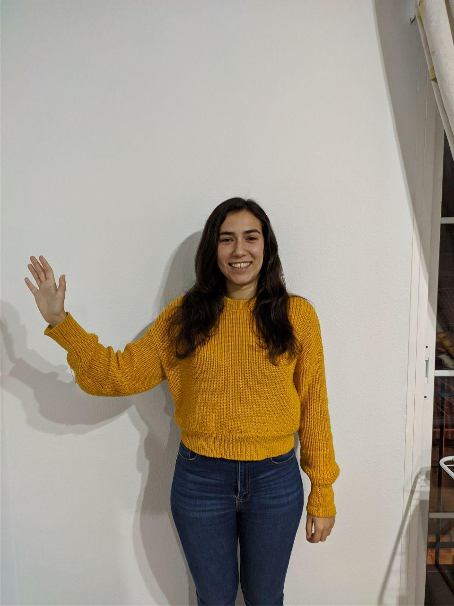
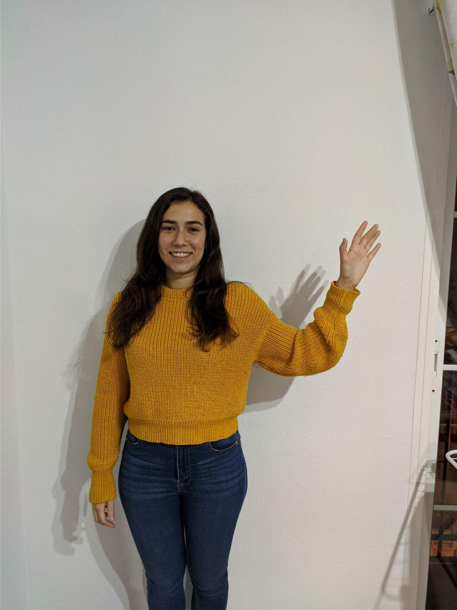
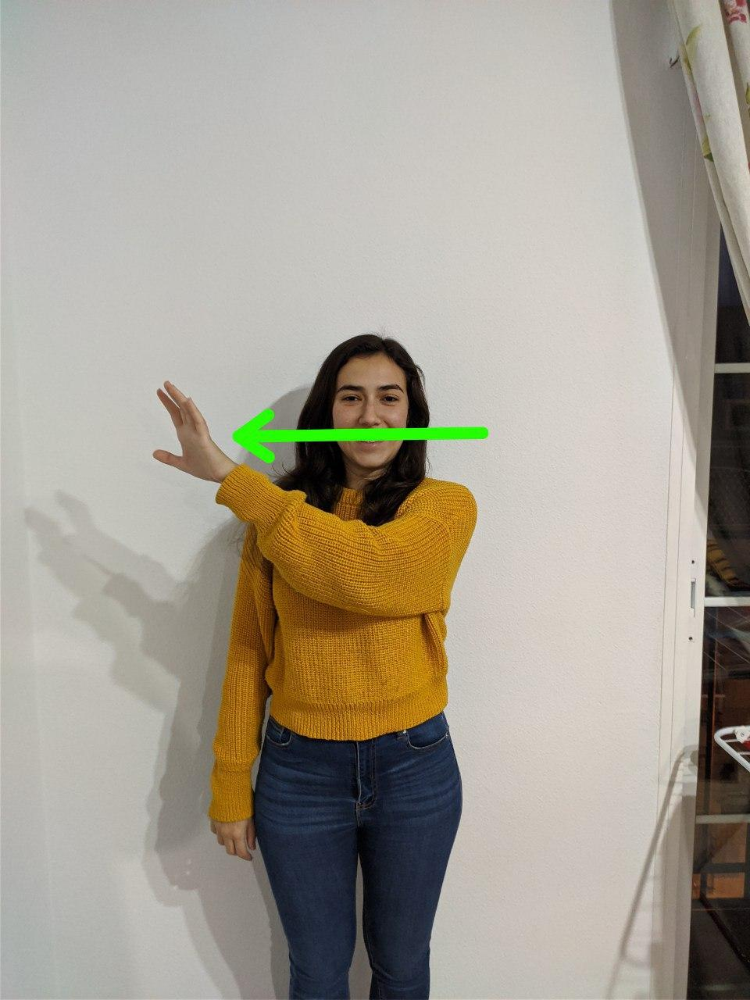

Introducción
============

El objetivo final de la práctica es facilitar al usuario un entorno de realidad virtual donde pueda inspeccionar una serie de elementos de interés en la Alhambra y que no sería posible hacerlo debido a su fragilidad.

Para ello implementamos un programa en el lenguaje de programación `C#` encargado de comunicar un proyecto en `Unity` con el hardware especializado del `Kinect`.

La escena `Unity` nos permitirá interactuar con una serie de objetos presentes en la escena principal, que junto con la interfaz por gestos nos permitirá realizar diferentes transforaciones sobre la vista de los objetos como rotaciones o acercamientos.

Estructura del proyecto
=======================

Como el objetivo de la práctica es la interfaz por gestos que se ha implementado, haremos especial incapié en aquellas partes de la implementación del proyecto.

Podemos dividir este proyecto en las siguientes partes.

- `Scene`. Escena de `Unity` que aloja los objetos que vamos a inspeccionar.
- `BodySourceManager`.
- `BodySouceView`.
- `Gesture`. Clase cuya finalidad es gestionar los gestos realizados.
- `GestureSegments`. Cada gesto quedará determinado por una serie de "segmentos" que determinarán la transición del mismo.

Escena de Unity
===============

La escena principal consta de 6 paredes que forman una cámara en cuyo centro se mostrará cada uno de los cinco objetos manipulables. Estos objetos se encuentran declarados en un array de `GameObject` llamado `Item`. Además de la camara principal `MainCamera` también se declaran un objeto de tipo `ligth` que ilumina la cámara.

BodySourceManager
=================

En este archivo ...

BodySourceView
==============

En este archivo de reciben las actualizaciones del dispositivo Kinect. A cada gesto se le asocia una funcion `GestureEvent`que se ejecutará cuando se detecte cada uno de los gestos.

GestureSegment
===============

Esta clase nos permite construir un segmento correspondiente a un gesto. Un objeto de esta clase debe tener implementado la función `update`, que será la encargada de indicar si dado un esqueleto detectado por el `Kinect` cumple una serie de restricciones.

Gesture
=======

Esta clase es la encargada de construir cada uno de los gestos que utilizamos en la práctica ademas de gestionar y comunicar al resto de estructuras cuando un gesto está siendo ejecutado.

Un gesto está compuesto de un array de `GestureSegments` que corresponden a un segmento de gesto, es decir, un paso intermedio en el gesto.

Esta clase será la encargada de gestionar la transición entre cada uno de dichos segmentos que componen el gesto e indicar cuando han finalizado. Se pueden construir dos tipos de gestos, discretos y continuos.

Estos se diferencian en cuando dan respuesta al resto de componentes del proyecto, un gesto discreto devuelve una "señal" cuando el gesto ha sido completado en su totalidad y luego se reinicia. Sin embargo, un gesto contínuo no se reinicia y continúa enviando la respuesta mientras nos encontremos en su etapa final.

Los gestos que hemos implementado
- ``Next`` y `Previous`. Gestos discretos que nos permiten navegar entre los distintos objetos que presentamos.
- ``ZoomIn`` y ``ZoomOut``. Gestos continuos que nos permiten alejar o acercar el objeto que estamos viendo.
- ``RotateLeft``, ``RotateRigth``, ``RotateUp`` y ``RotateDown``. Gestos continuos que nos permiten rotar el objeto que estamos viendo en las distintas direcciones.

Cabe destacar que los gestos continuos se pueden fusionar, es decir, siempre que los movimientos sean compatibles, podemos ejecutar 2 de ellos a la vez, por ejemplo, acercar y rotar el objeto simultaneamente.

Para gestionar todo lo referente a los distintos gestos, el constructor de la clase nos obliga a pasarle un `string` indicando que gesto queremos inicializar, con esto la propia clase se encarga de seleccionar los segmentos que le corresponden.

La clase implementa una función `update` que es llamada en cada frame de `Unity`, suya finalidad es gestionar si se esta cumpliendo el siguiente segmento del gesto.
Para realizar el mismo tenemos una "ventana" de tiempo entre los diferentes segmentos, de forma que si la excedemos el gesto se resetea y sería necesario volver al segmento inicial del mismo.

Cada objeto de la clase tiene un miembro `EventHandler` que nos permite añadirle funciones con sus respectivos argumentos, de forma que la clase `BodyView` añade las funciones que afectan a la escena `Unity` al miembro del gesto correspondiente.

Veamos cuales son estos gestos con los siguientes ejemplos que nuestros apuestos programadores han preparado.

| Next          || Prev                   | |
| ------------- |-------------|------|------|
| {height=125px} |{height=125px} |{height=125px} |{height=125px} |

| Rotate | | | | |
| ------------- |-------------|------|------|---|
| Origin | Right | Left | Up | Down|
|{height=100px} |{height=100px} |{height=100px} |{height=100px} |{height=100px}|

|Zoom In | |Zoom Out  | |
| ------------- |-------------|------|------|
|{height=125px} |{height=125px} |{height=125px} |{height=125px}|
